# ☀️ Sunlight

Everything is visible under the sunlight.

**Sunlight** is a simple tool for analyzing Instagram exported data.  
Put your Instagram files next to Sunlight, run it, and it will create clean result files for you.

## ⭐ Support The Project

If you find **Sunlight** useful, please consider giving the project a star on GitHub.

Your star helps more people discover the project and motivates me to keep improving it.

⭐ Thank you for your support!

## ✨ Features

- 👀 Find people you follow who do not follow you back
- 🤝 Find people who follow you, but you do not follow back
- 📩 Extract recent follow requests
- 📊 Create basic page statistics
- 🔗 Generate Instagram profile links

## 🔒 Security

Sunlight does **not** send, upload, or share your data with anyone or anywhere.

Everything happens locally on your own computer.  
Your Instagram files stay on your computer, and the result files are created in the same folder as Sunlight.

## 📥 How To Export Instagram Data

1. Open Instagram.
2. Go to your profile.
3. Open the menu.
4. Go to **Accounts Center**.
5. Open **Your information and permissions**.
6. Choose **Download your information**.
7. Select your Instagram account.
8. Choose the information related to followers and following.
9. Select **JSON** format.
10. Create the export request.
11. Download the file when Instagram prepares it.
12. Extract the downloaded ZIP file.
13. Find these files and place them next to Sunlight:

```text
followers_1.json
following.json
recent_follow_requests.json
```

## 🚀 How To Use EXE Version

1. Put `Sunlight-v3.0.exe` in a folder.
2. Put your Instagram JSON files in the same folder.
3. Double-click `Sunlight-v3.0.exe`.
4. Wait until the result files are created.

## 🐍 How To Use Source Code Version

If you prefer to run the source code directly:

1. Install Python.
2. Download or clone this repository.
3. Put your Instagram JSON files in the same folder as `Sunlight.py`.
4. Run this command:

```bash
python Sunlight.py
```

## 🧭 Step-by-Step Guide

This guide shows how to export your Instagram data, place the files next to Sunlight, run the app, and get the final results.

### 📥 Export Instagram Data

#### Step 1:
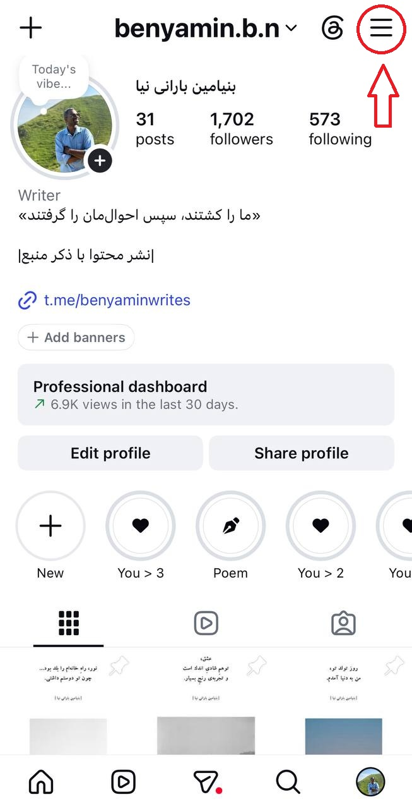


#### Step 2:
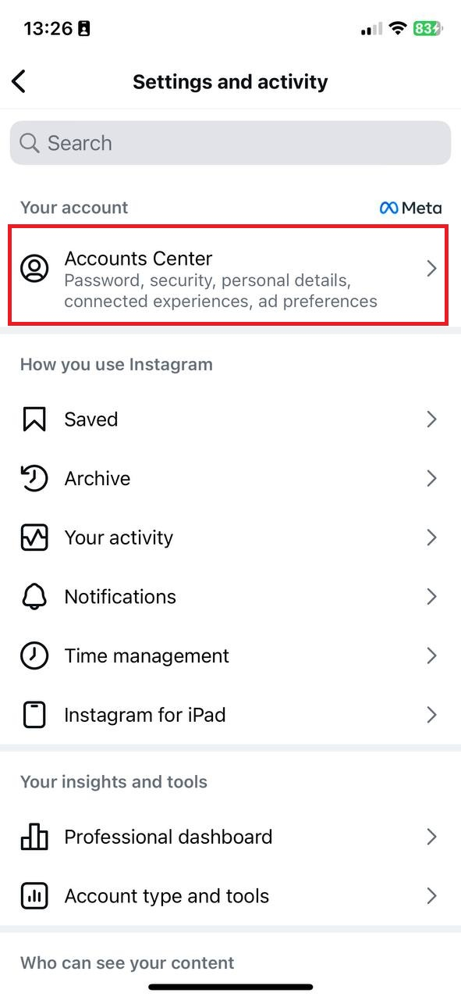

#### Step 3:
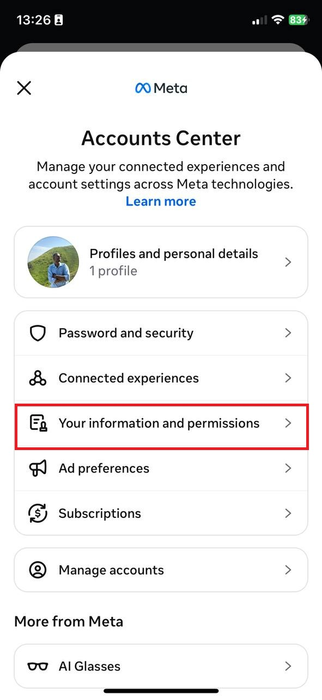

#### Step 4: 
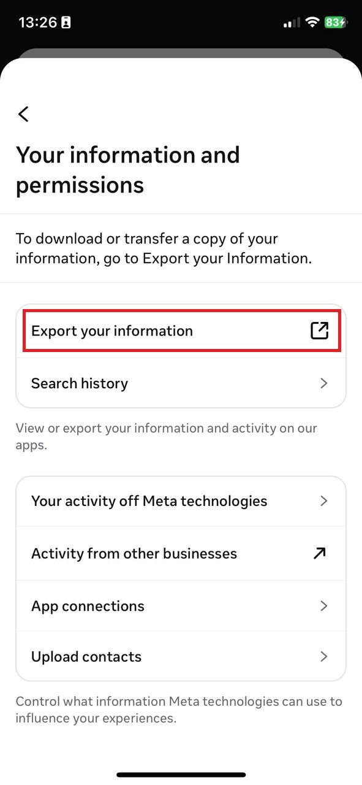

#### Step 5:
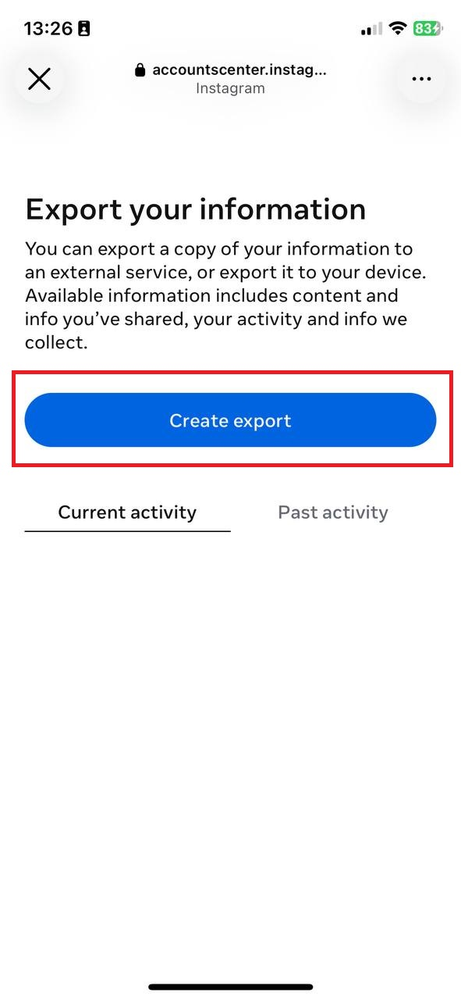

#### Step 6:
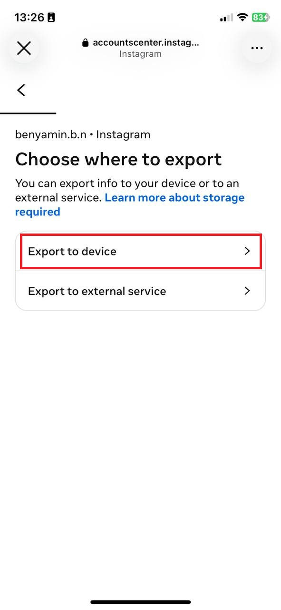

#### Step 7:
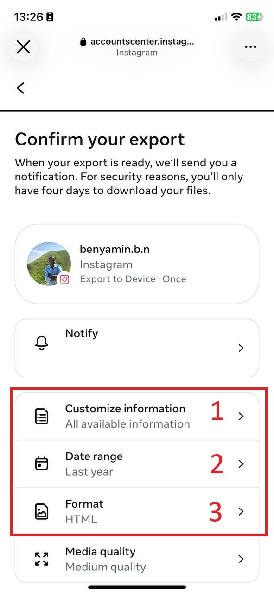

#### Step 8: Choose followers and following information
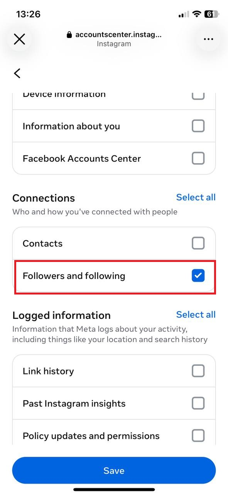

#### Step 9: 
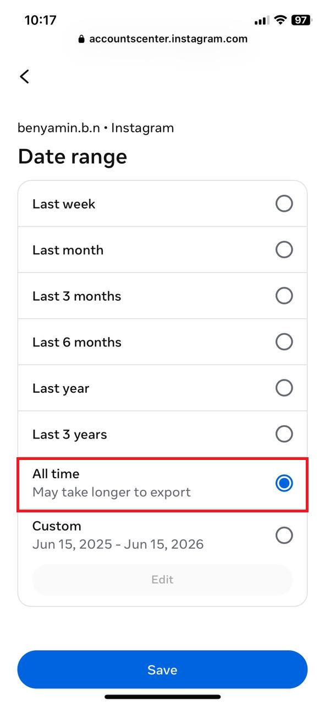

#### Step 10: Choose JSON format
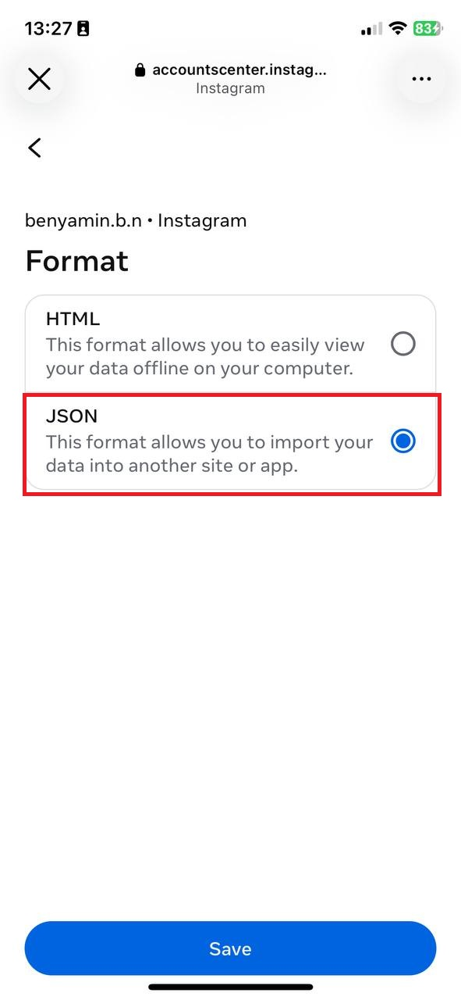

#### Step 11:
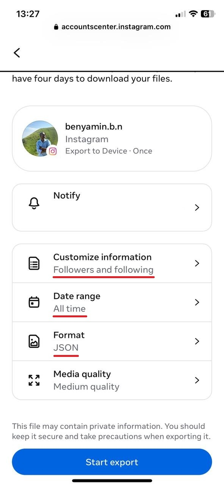

#### Step 12:
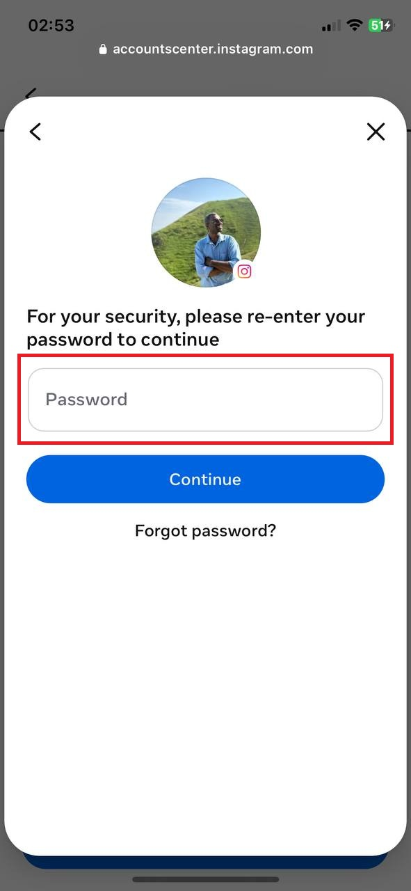

#### Step 13: Wait for Instagram to prepare your data
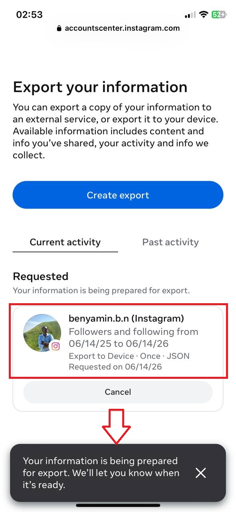

#### Step 14: Wait for Instagram to prepare your data
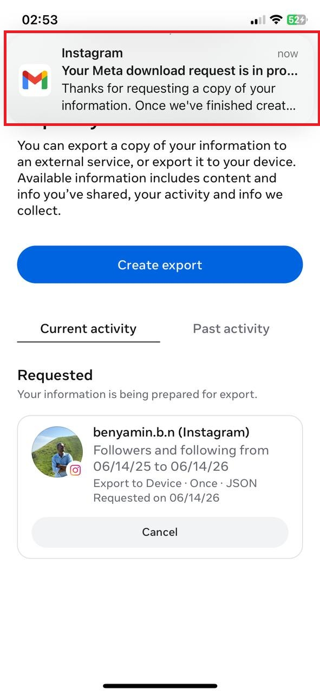 

#### Step 15: Download your Instagram data
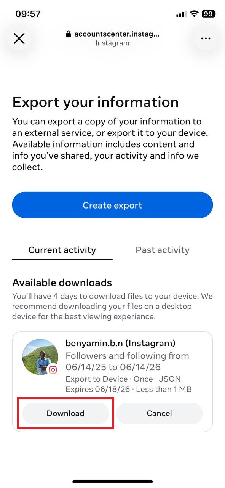

#### Step 16: Download your Instagram data
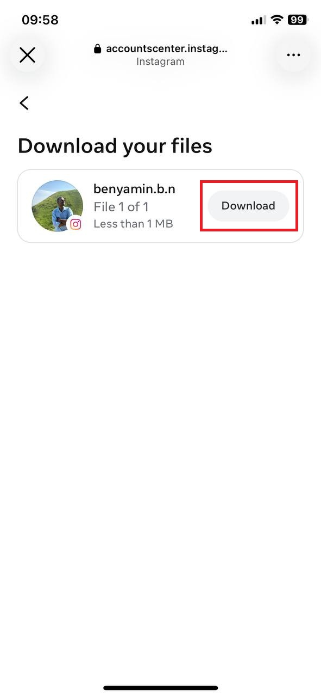

#### Step 17: Download your Instagram data
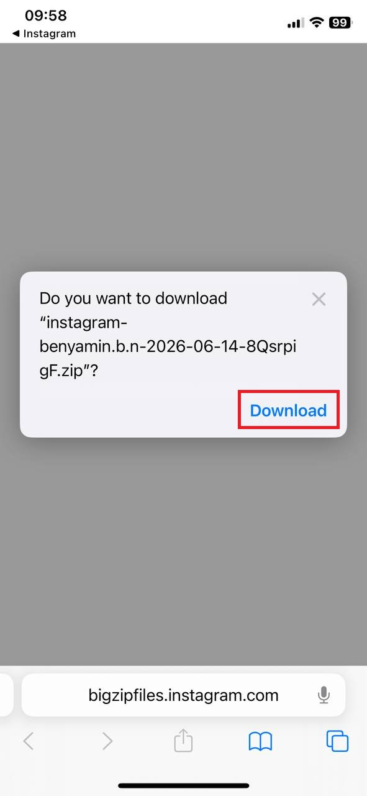

#### Step 18: Extract the downloaded ZIP file (PC or Laptop)
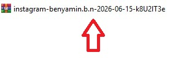

#### Step 19: Find the required JSON files
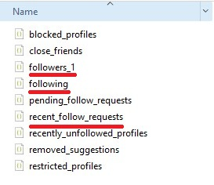


You need these files:

```text
followers_1.json
following.json
recent_follow_requests.json
```

### ☀️ Run Sunlight

#### Step 20:
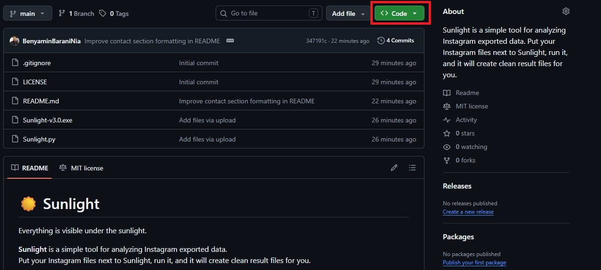

#### Step 21:
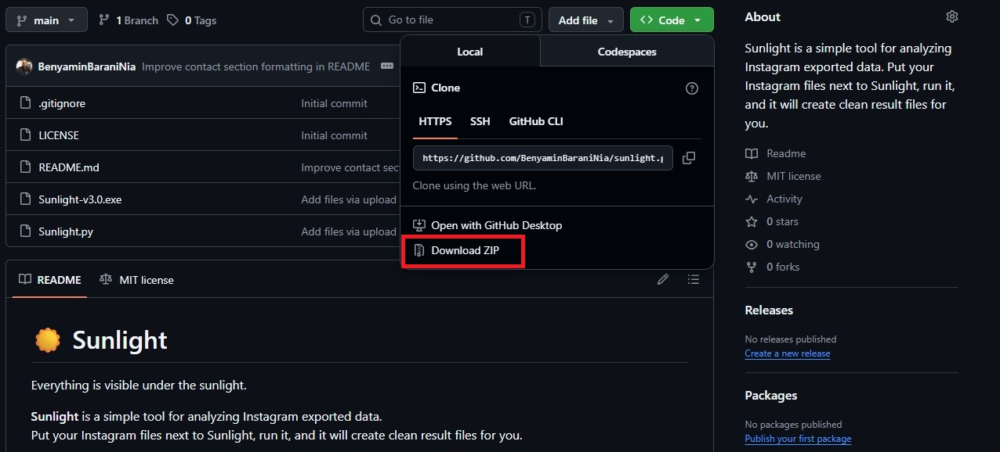

#### Step 22: Extract the 'sunlight-main'
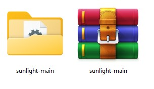

#### Step 23: Open the folder
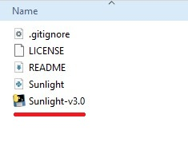


#### Step 24: Put the Instagram JSON files next to Sunlight-v3.0 (from Step 19)
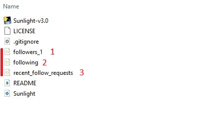

⭐Your folder should look like this:

```text
Sunlight-v3.0.exe
followers_1.json
following.json
recent_follow_requests.json
```

#### Step 25: Double-click Sunlight-v3.0.exe
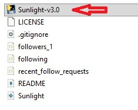

#### Step 26:
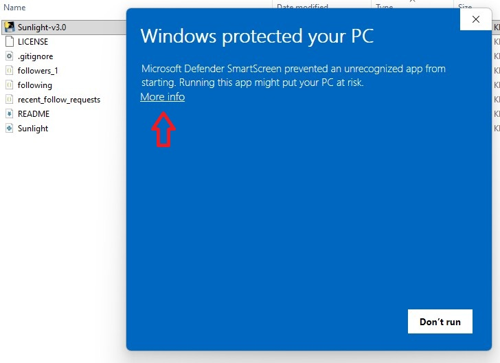

#### Step 27:
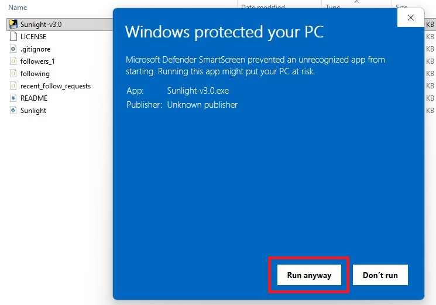

#### Step 28: Wait for Sunlight to process the files
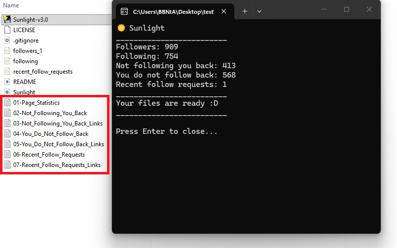

Congratulations 🎉

## 📄 Output Files

Sunlight creates these files:

```text
01-Page_Statistics.txt
02-Not_Following_You_Back.txt
03-Not_Following_You_Back_Links.txt
04-You_Do_Not_Follow_Back.txt
05-You_Do_Not_Follow_Back_Links.txt
06-Recent_Follow_Requests.txt
07-Recent_Follow_Requests_Links.txt
```

## 📊 Statistics

`01-Page_Statistics.txt` shows a quick summary:

```text
Followers: 1200
Following: 900
Not following you back: 150
You do not follow back: 300
Recent follow requests: 5
```

## 🛠️ Reporting Issues

If you find a bug or have a problem, please open an issue in this GitHub repository or send me an email.

Please include:

- What happened
- What you expected to happen
- A screenshot of the error, if possible
- Which file caused the problem, if you know it

Please do **not** share private Instagram data publicly.  
Remove usernames or personal information before sending examples.

## 📬 Contact Me

- Email: [Benyamin.Barani.Nia@gmail.com](mailto:Benyamin.Barani.Nia@gmail.com)
- Website: [BenWrites.ir](https://www.BenWrites.ir/)
- GitHub: [BenyaminBaraniNia](https://github.com/BenyaminBaraniNia)
- Instagram: [@benyamin.b.n](https://www.instagram.com/benyamin.b.n/)
- Telegram Channel: [@benyaminwrites](https://t.me/benyaminwrites)

## 💡 Notes

Sunlight uses `utf-8` encoding to better support Persian, Arabic, emojis, and special characters.
